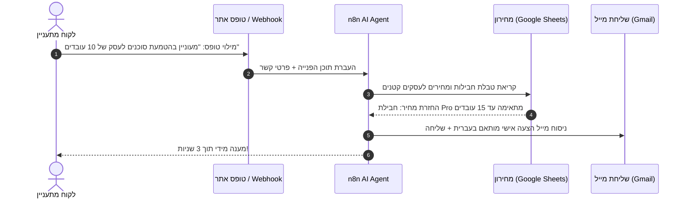

אם עד היום השתמשתם באוטומציות קלאסיות (כמו "אם מתקבל ליד בטופס &larr; שלח מייל תודה"), אתם יודעים כמה הן נוקשות: מספיק שהלקוח שאל שאלה לא צפויה, וכל התהליך נתקע. בשנת 2026, **סוכני AI (AI Agents)** משנים לחלוטין את חוקי המשחק — הם לא רק עוקבים אחרי תרשים זרימה נוקשה, אלא **מבינים כוונה, מחליטים אילו כלים להפעיל, ופותרים בעיות מורכבות באופן עצמאי**.

פלטפורמת **n8n** הפכה לכלי העוצמתי והפופולרי ביותר בעולם לבניית סוכנים כאלה ללא צורך בכתיבת קוד (No-Code). במדריך מעשי זה נבנה יחד מאפס סוכן AI עסקי מלא שמקבל פניות, מתשאל מסדי נתונים, שולף מידע עדכני ומחזיר תשובות מדויקות במייל או בוואטסאפ.

תמונת מצב: האנטומיה של סוכן AI ב-n8n

1. הטריגר (Trigger)

האירוע שמפעיל את הסוכן: מייל חדש, הודעת צ'אט, וובהוק (Webhook) או תזמון קבוע (Cron).

2. המוח (Chat Model)

מודל השפה (LLM) שמנתח את הבקשה, מבין את ההקשר ומקבל החלטות (Gemini, Claude, GPT).

3. הזיכרון (Memory)

שומר היסטוריית שיחה ופרטי לקוח כדי שהסוכן יזכור את שלבי השיחה הקודמים.

4. הכלים (Tools)

ה"ידיים" של הסוכן: קריאה ל-Google Sheets, שאילתת CRM, שליחת מיילים ומחשבון.

---

## שלב 1: הקמת סביבת עבודה ב-n8n

לפני שמתחילים לחבר רכיבים, עליכם להחליט היכן ירוץ ה-n8n שלכם:

1. **n8n Cloud:** סביבת ענן רשמית המנוהלת על ידי n8n (מציעה תקופת ניסיון ללא עלות).
2. **Self-Hosted (חינמי בקוד פתוח):** הרצה עצמאית על גבי שרת מקומי, מחשב בבית או שרת VPS.
   > 💡 **טיפ לחסכנים:** רוצים שרת אוטומציות פרטי ב-0 שקלים לחודש? קראו את המדריך שלנו: [איך להקים שרת n8n ביתי בחינם מטלפון אנדרואיד ישן](/posts/2026-04-21-n8n-server-old-android-phone-guide).

לאחר שנכנסתם לממשק ה-n8n שלכם, לחצו על **Add Workflow** כדי לפתוח לוח עבודה חדש וריק.

---

## שלב 2: הוספת רכיב ה-AI Agent

במרכז הלוח, לחצו על כפתור הפלוס (`+`) וחפשו את הצומת (Node) שנקרא **AI Agent**.

<h3 class="text-lg font-bold text-foreground m-0">הגדרות צומת ה-AI Agent</h3>
Core Engine

<strong class="text-foreground">Agent Type:</strong> בחרו ב-<code>Tools Agent</code>. זהו הסוג המומלץ ביותר המאפשר למודל לבחור באופן דינמי אילו כלים להפעיל בהתאם לשאלת המשתמש.

<strong class="text-foreground">System Prompt (הנחיות יסוד):</strong> כאן נגדיר את זהות הסוכן ותפקידו.

אתה סוכן שירות לקוחות וסיווג לידים מקצועי של חברת AI World. 
תפקידך לנתח את פניית הלקוח, לבדוק את פרטיו במאגר המידע, ולענות בצורה אדיבה, תמציתית ומקצועית בעברית. 
השתמש בכלים העומדים לרשותך כדי לשלוף מידע מדויק. לעולם אל תמציא נתונים שאינם קיימים בכלים.

---

## שלב 3: חיבור ה"מוח" (Chat Model)

רכיב ה-AI Agent ב-n8n דורש חיבור למודל שפה. בתחתית צומת ה-Agent תראו נקודת חיבור בשם **Model**:

1. לחצו על נקודת החיבור וחפשו **Google Gemini Chat Model** (או **OpenAI Chat Model**).
2. הכניסו את מפתח ה-API שלכם.
   > 🚀 **מדריך משלים:** למידע על קבלת מפתח API חינמי לחלוטין ללא הגבלת ניסיון, ראו את [המדריך המלא ל-Google AI Studio ו-Gemini API בעברית](/posts/2026-04-21-gemini-api-free-google-ai-studio-guide).
3. בחרו במודל **`gemini-1.5-flash`** או **`gpt-4o-mini`**. מודלים אלו מצטיינים במהירות תגובה גבוהה, הבנת פרומפטים מורכבים ועלות כמעט אפסית.

---

## שלב 4: הוספת זיכרון שיחה (Memory)

אם הסוכן שלכם מנהל שיחה (למשל בוואטסאפ או בצ'אט באתר), הוא חייב לזכור מה הלקוח אמר לפני רגע:

1. חברו לנקודת ה-**Memory** בצומת ה-Agent את הרכיב **Window Buffer Memory**.
2. הגדירו **Context Window Length** לערך של `10` (זוכר את 10 ההודעות האחרונות ברצף).
3. הגדירו **Session Key** ייחודי (למשל כתובת המייל או מספר הטלפון של הלקוח) כדי למנוע ערבוב בין שיחות של משתמשים שונים.

---

## שלב 5: הענקת "ידיים ורגליים" (Tools Integration)

זהו החלק שבו האוטומציה הופכת לסוכן אמיתי. תחת חיבור ה-**Tools**, תוכלו לחבר מגוון כלים שהסוכן יפעיל באופן עצמאי:

📊 כלי 1: שאילתת Google Sheets / Airtable

מאפשר לסוכן לקרוא מחירון, לבדוק זמינות מלאי או לשלוף סטטוס הזמנה של לקוח קיים לפי מספר מזהה.

<strong>תיאור לכלי (Tool Description):</strong> "משמש לקריאת מחירי מוצרים וזמינות מלאי עדכנית מגיליון הנתונים".

✉️ כלי 2: שליחת מייל או עדכון CRM

מאפשר לסוכן להפיק הצעת מחיר מותאמת ולשלוח אותה ישירות למייל של הלקוח, או לפתוח כרטיס ליד ב-HubSpot/Pipedrive.

<strong>תיאור לכלי (Tool Description):</strong> "שולח מייל רשמי ללקוח עם פרטי ההצעה ומעדכן את כרטיס הליד במערכת".

> ⚠️ **כלל זהב בכלי סוכנים:** ה-AI מחליט אם להשתמש בכלי בהתאם ל-**Tool Description** שכתבתם. הקפידו לכתוב תיאור ברור ומדויק באנגלית או בעברית המסביר מתי יש להשתמש בכלי ומה הנתונים הנדרשים לו.

---

## תרחיש מעשי: סוכן מענה וסיווג לידים מקצה לקצה

בואו נראה כיצד התהליך עובד בפועל ברגע שלקוח שולח פנייה:

---

## 4 טעויות נפוצות של מתחילים ב-n8n (ואיך להימנע מהן)

❌ 1. פרומפט כללי ועמום מדי

מתן הנחיה קצרה כמו "ענה ללקוחות" יגרום לסוכן להמציא תשובות (הזיות). הגדירו תמיד גבולות גזרה ברורים: מה מותר לסוכן לעשות, מה אסור לו, ומה לעשות כשאין לו תשובה.

❌ 2. תיאורי כלים לא מדויקים

אם לא תפרטו בדיוק אילו שדות הכלי מצפה לקבל, הסוכן עלול להעביר ערכים ריקים או שגויים לצומת הבא ולגרום לקריסת ה-Workflow.

❌ 3. אי-הגבלת לולאות איטרציה (Max Iterations)

כדי למנוע מצב שבו הסוכן נכנס ללולאה אינסופית ומבזבז קרדיטים של API, הגדירו תמיד את שדה ה-<code>Max Iterations</code> בהגדרות הסוכן ל-`5` או `10`.

❌ 4. ויתור על שלב Human-in-the-Loop בפעולות רגישות

למשימות קריטיות (כמו חיוב כרטיס אשראי או מחיקת נתונים), חברו צומת אישור אנושי (Slack / WhatsApp / Email Approval) לפני ביצוע הפעולה הסופית.

---

## שאלות נפוצות (FAQ)

מה היתרון של בניית סוכן ב-n8n לעומת שימוש ישיר ב-ChatGPT?
&#9660;

ב-n8n הסוכן אינו רק משיב בטקסט: הוא מחובר ישירות לכלים האמיתיים שלכם (Gmail, WhatsApp, Notion, CRM, מסדי נתונים), יכול לקבל החלטות בזמן אמת, להפעיל תהליכים אוטונומיים 24/7 ולשמור על פרטיות מלאה של נתוני העסק.

האם באמת אפשר לבנות סוכן AI ב-n8n ללא ידע בתכנות?
&#9660;

כן לחלוטין. n8n מספקת ממשק ויזואלי אינטואיטיבי של גרירה ושחרור (Drag & Drop) עם צמתי AI Agent מובנים, חיבורי מודלים מוכנים (OpenAI, Google Gemini, Anthropic) ואינטגרציות למאות כלים עסקיים בלי צורך בכתיבת קוד.

כמה עולה להריץ סוכן AI ב-n8n?
&#9660;

הפלטפורמה של n8n היא בקוד פתוח וניתנת להתקנה עצמית (Self-hosted) בחינם לחלוטין. העלות היחידה היא סנטים בודדים לחודש עבור קריאות ה-API למודל השפה (למשל Google Gemini Flash או GPT-4o-mini).

באיזה מודל שפה כדאי להשתמש עבור הסוכן?
&#9660;

לרוב המשימות העסקיות היומיומיות מומלץ להתחיל עם Google Gemini 1.5 Flash (דרך Google AI Studio) או GPT-4o-mini, המספקים זמני תגובה של שבריר שניה, הבנת כוונות מעולה ועלויות זניחות.

---

<h3 class="text-xl font-bold text-foreground">רוצים להעמיק בעולם הסוכנים והאוטומציה?</h3>

גלו עוד מדריכים מעשיים באשכול סוכני ה-AI שלנו:

<a href="/posts/2026-04-21-ai-agents-platforms-business-2026-guide" class="group flex flex-col overflow-hidden rounded-2xl border border-border/80 bg-card transition-all duration-300 hover:-translate-y-1 hover:border-accent/60 hover:shadow-lg no-underline">

מדריך עוגן מרכזי
<h4 class="text-base font-bold text-foreground group-hover:text-accent transition-colors m-0 leading-snug">10 פלטפורמות AI Agents שמשנות את העבודה העסקית ב-2026</h4>

הסקירה המלאה של כלי הסוכנים המובילים בעולם: מגוגל ומיקרוסופט ועד סיילספורס.

לקריאת המדריך &larr;

</a>

<a href="/posts/2026-04-21-n8n-server-old-android-phone-guide" class="group flex flex-col overflow-hidden rounded-2xl border border-border/80 bg-card transition-all duration-300 hover:-translate-y-1 hover:border-accent/60 hover:shadow-lg no-underline">

תשתית שרת בחינם
<h4 class="text-base font-bold text-foreground group-hover:text-accent transition-colors m-0 leading-snug">איך להקים שרת אוטומציות n8n ביתי בחינם מטלפון ישן</h4>

הופכים סלולרי ישן לשרת אוטומציות פרטי שרץ 24/7 ב-0 שקלים לחודש.

לקריאת המדריך &larr;

</a>

<a href="/posts/2026-09-14-excel-automation" class="group flex flex-col overflow-hidden rounded-2xl border border-border/80 bg-card transition-all duration-300 hover:-translate-y-1 hover:border-accent/60 hover:shadow-lg no-underline">

אינטגרציה וחיסכון בזמן
<h4 class="text-base font-bold text-foreground group-hover:text-accent transition-colors m-0 leading-snug">איך לבצע אוטומציה מלאה באקסל באמצעות כלי AI</h4>

חיסכון של שעות עבודה שבועיות בדוחות כספיים וניתוח נתונים מורכבים.

לקריאת המדריך &larr;

</a>

